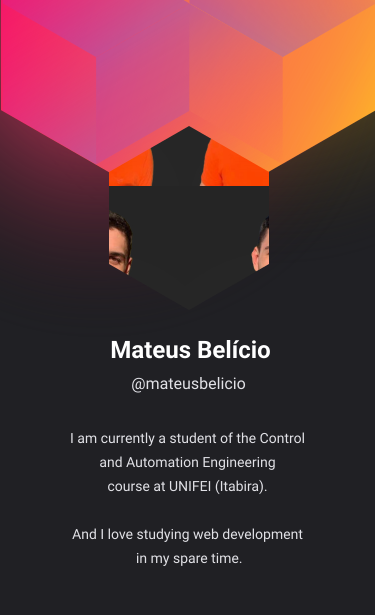

<!--

-->

# Hi 👋🏻, I'm Mateus Belício

  

- 🔭 I'm currently looking for a job as front-end developer
- 🌱 I’m currently learning React, Node.js and MongoDB
- 🤔 I'm looking to participate in a project to increase my experience, if you know of any just tell me

## 🛠 &nbsp;Tech Stack

&nbsp;
&nbsp;
&nbsp;
&nbsp;
&nbsp;
&nbsp;
&nbsp;
&nbsp;
&nbsp;
&nbsp;

<!--
&nbsp;
&nbsp;
&nbsp;
&nbsp;
&nbsp;
-->

<!--
## ⚙️ &nbsp;GitHub Analytics

-->

## 📫 &nbsp;Contact

<!--

-->

<!--
- 🔭 I’m currently working on/at ...
- 🌱 I’m currently learning ...
- 👯 I’m looking to collaborate on ...
- 🤔 I’m looking for help with ...
- 💬 Ask me about ...
- 📫 How to reach me: ...
- 😄 Pronouns: ...
- ⚡ Fun fact: ...
- 🔥 Sênior Web Developer ...
- ▶️ I (not) regularly post videos on [youtube.com/username](https://youtube.com/username)
- 💬 Ask me about **JavaScript, HTML, CSS, SQL, Node.JS
- 👨🏻‍💻 More at [mateusbelicio.dev](https://mateusbelicio.dev)
-->
<!--

-->

