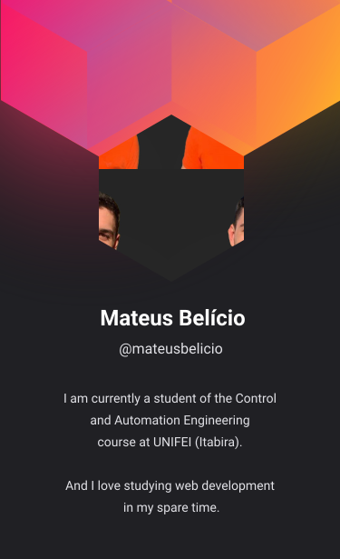

<!--  -->

### Hi there! 👋🏻

I'm **Mateus Belício**, I recently finished my degree in Control and Automation Engineering at the Federal University of Itajubá (Itabira, Brazil) and I'm currently studying to become a front-end developer. I want to pursue a career as a developer because I am passionate about web programming and I love creating new projects and learning more and more about web development.

---

### 📖 &nbsp;About me

<!--- Web illustrations by Storyset ( https://storyset.com/web ) --->

- 🔭 I'm currently looking for a job as front-end developer.
- 🌱 I’m currently learning **Next.js** and **TypeScript**.
- 👨🏻‍💻 I'm looking to participate in a project to increase my experience as developer. If you know of any or want to do a project with me, just tell me.
- 🔍 Take a look at my projects on [Frontend Mentor](https://www.frontendmentor.io/profile/mateusbelicio) and on my personal portfolio at [mateusbelicio.dev](https://mateusbelicio.dev).
- 📫 How to reach me:
  **[send me an email](mailto:mateusbelicio.dev@gmail.com)**. 

### 🛠️ &nbsp;Languages and Tools

- **Frontend:** HTML, CSS, JavaScript, React.js, StyledComponents, Sass, TailwindCSS
- **Backend:** Node.js, Express, Mongoose
- **Database:** MongoDB
- **More:** Git, GitHub, C++, TypeScript, Next.js

---

<!--  -->

<!-- ### ⚙️ &nbsp;GitHub Analytics

 -->

<!-- 

&nbsp;
&nbsp;
&nbsp;
&nbsp;
&nbsp;
&nbsp;
&nbsp;
&nbsp; 
&nbsp;
&nbsp;
&nbsp;

-->

<!--
- 🔭 I’m currently working on/at ...
- 🌱 I’m currently learning ...
- 👯 I’m looking to collaborate on ...
- 🤔 I’m looking for help with ...
- 💬 Ask me about ...
- 📫 How to reach me: ...
- 😄 Pronouns: ...
- ⚡ Fun fact: ...
- 🔥 Sênior Web Developer ...
- ▶️ I (not) regularly post videos on [youtube.com/username](https://youtube.com/username)
- 💬 Ask me about **JavaScript, HTML, CSS, SQL, Node.JS
- 👨🏻‍💻 More at [mateusbelicio.dev](https://mateusbelicio.dev)
-->
